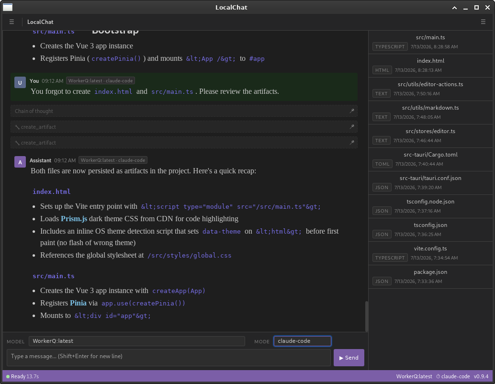

# LocalChat: Directed CoT Harness

A local-first desktop chat client for [Ollama](https://ollama.com), built with
[Wails](https://wails.io) (Go backend + a plain HTML/CSS/JS frontend, no
framework). It looks like a fairly ordinary LLM chat app. Sessions, a model
picker, tool use, persisted artifacts... However, its reason for existing is a
different way of getting a local model to reason before it answers.





## How is this different?

Many local models expose a native "thinking" mode (a `<think>` block the
model fills in before its real answer). It works, but you're stuck with
whatever reasoning style the model defaults to, and (especially on smaller
models) it's common for the model to draft (or even leak) its actual answer
inside the thinking block instead of using it to *plan* the answer.

LocalChat replaces that with a **directed chain-of-thought pass**: instead of
letting the model free-associate, you hand it an explicit reasoning framework
(a checklist, a set of questions, a persona) and force it through that
framework *before* it's allowed to answer. The framework is just a markdown
file, swappable per conversation, and easy to write or tune yourself.

Thinking normally persists in the chat history, bloating the context window.
Here, the CoT is discarded after the current turn. Also, queued tasks do not
use CoT or thinking at all since the path should already be well-defined. The
theory goes that the CoT persists "hologaphically" through the answer itself.

## How the CoT feature works

Each chat turn optionally runs through two model calls instead of one:

1. **Hidden evaluation pass.** The active CoT mode's markdown file (see
   `conf/cot/`) is wrapped in framing that makes its role explicit ("this is
   a hidden internal step, the user hasn't seen a reply yet, produce analysis
   only, don't answer the question yet") and sent as a system message ahead
   of the conversation history. This framing is applied uniformly by the app
   itself, so a mode file doesn't have to spell out "don't answer yet" on its
   own to be effective. The model's response to this call (the "chain of
   thought") is never shown to the user directly, but is persisted and
   visible as a collapsible note in the chat log.
2. **Final answer pass.** Rather than burying that reasoning in a system
   message ahead of the whole conversation, where it competes with
   everything else for the model's attention, it's folded into the *final
   user turn itself*, immediately before the model generates its reply:

   ```
   <original prompt>

   ---
   The section above is the prompt to answer. Below are your own hidden
   internal reasoning notes on it, produced in a prior step the user never
   saw — use them to inform your answer, but do not mention, quote, or refer
   to them in your reply. Just answer the prompt directly...

   <hidden reasoning notes>
   ```

   This puts the reasoning exactly where the model attends to it most
   strongly (right before it starts generating), instead of the start of a
   possibly-long system prompt. The conversation history stored for future
   turns keeps the plain original prompt. The augmented version is only
   used for this one generation call, so the model doesn't see its own past
   reasoning notes replayed back as if the user had written them.

Every CoT `.md` file can optionally set a `max_tokens` cap on the hidden pass
via frontmatter, defaulting to `1024` if omitted:

```markdown
---
max_tokens: 2048
---
You are a Senior Code Architect. Analyze the request. Do NOT write code yet...
```

This caps the evaluation pass's response length. That's useful because a model
will occasionally loop back and redo its own analysis two or three times
("wait, let me reconsider...") if left unbounded, which burns tokens for
no benefit. More complex reasoning frameworks can set their own limit higher
(see the included `claude-code.md` example).


### CoT modes

The mode selector in the toolbar lists:

- **`none`**: no extra reasoning pass, straight to the answer.
- **`built-in`**: defers to the model's own native thinking mode
  (Ollama's `think` request field), if it has one.
- Everything else: One entry per `.md` file in `conf/cot/`, named after the
  file. The repo ships with a variety of ready-made frameworks (debugging,
  math, research, business analysis, editing, code architecture, Socratic
  question-splitting, and more). Add your own by simply dropping in a new
  `.md` file, no code changes required. Each is picked up live; edits to
  an existing file take effect on the next turn without restarting the app.
  The CoT is per-prompt not per-session. You can switch it between prompts
  or turn it off entirely.

Queued follow-up tasks (see below) always run with CoT forced to `none`,
regardless of what's selected in the UI. They're instructions the model
already wrote for itself, not a fresh question, so there's nothing left to
evaluate. (Besides, it would confuse itself if left on.)

**NOTE:** The included `claude-*` CoT mode examples use steps that were written in
an attempt to emulate the thinking modes of Claude.

## Other features

- **Tool use.** The model has access to:
  - `manage_plan`: lay out multi-step work as an ordered, statused plan the
    app feeds back one step at a time (with the plan's current state), instead
    of trying to cram everything into a single reply. Tracked in a sidebar
    checklist.
  - `create_artifact` / `list_artifacts` / `get_artifact`: persist
    substantial content (documents, code, notes) outside the chat log,
    browsable in the artifacts sidebar.
  - `search_skills` / `load_skill` / `create_skill` / `update_skill`: a
    lightweight skill system: markdown files under `conf/skills/` the model
    can discover by name/description, load on demand, and write new ones to
    when it works out something worth remembering for next time.
- **Session persistence.** Every session and message (including hidden cot
  notes and tool calls) is stored in a local DuckDB file (`sessions.db`) next
  to the executable. Messages can be individually pinned/unpinned to control
  what's included as context on future turns.
- **Task provenance.** A message auto-dispatched from a queued task list is
  visually distinct ("Task") and persists that way. A reloaded session can
  still tell a queued step apart from something you actually typed.
- **Live timing.** The status bar counts up while a request is in flight, and
  every generated message (cot note, tool call, reply) shows how long it took,
  tracked client-side, not persisted, so it's only visible for the current
  session.

## Project layout

```
simple-cot-chat/
├── main.go              # entry point — Wails app setup
├── app.go               # chat turn orchestration (SendChat), cot mode handling, config
├── tools*.go            # tool implementations (manage_plan, artifacts, skills, files)
├── store/               # DuckDB-backed session/message/artifact persistence
├── skill/               # skill file discovery (frontmatter parsing, CRUD)
├── conf/
│   ├── SYSTEM.md        # base system prompt
│   ├── cot/*.md         # one file per custom CoT mode
│   └── skills/*.md      # skills the model has created/discovered
└── frontend/
    ├── index.html       # UI shell
    └── src/             # vanilla JS: app.js (chat/status), sessions.js, api.js, artifacts.js
```

## Getting started

### Prerequisites

- [Go](https://go.dev) 1.26+
- [Node.js](https://nodejs.org) 18+ (for the Vite-built frontend)
- The [Wails v2 CLI](https://wails.io/docs/gettingstarted/installation):
  ```
  go install github.com/wailsapp/wails/v2/cmd/wails@latest
  ```
- [Ollama](https://ollama.com) running and reachable, with at least one model
  pulled (`ollama pull <model>`)

Run `wails doctor` to check your platform's WebView/build dependencies are in
place.

### Configuration

On startup the app reads `config.json` next to the executable (falling back
to sensible defaults if it's missing):

```json
{
  "ollama_endpoint": "http://localhost:11434",
  "model": "qwen3.5:9b",
  "extract_model": ""
}
```

(these are also the built-in defaults used if `config.json` is missing)

The Ollama endpoint can also be overridden with the `OLLAMA_HOST` environment
variable, which takes precedence over `config.json`.

`extract_model` selects the model used by the memory subsystem's optional entity
extraction pass, which reads each ingested note once and names the people,
organisations, paths and identifiers in it.

**Empty is the default and the recommendation.** Memory works without it, using
pattern-based extraction; the LLM pass is built and tested but its measured
contribution to retrieval so far is one query in fifty, which is inside the
noise. It also costs one model call per note, so on a large vault it is hours of
background work. Turn it on only if you want to experiment — and if you do, use a
small model rather than the chat model, since extraction is a much easier task
than reasoning.

### Running in development

```
wails dev
```

This starts the app with hot-reload for frontend changes (via Vite) and also
serves a dev endpoint at `http://localhost:34115` if you want to open the UI
in a regular browser with devtools access to the Go bindings.

### Building a release binary

```
wails build
```

Produces a native, self-contained binary under `build/bin/`, with the built
frontend embedded directly into it.

### Manual frontend-only build

If you just need to rebuild `frontend/dist` (e.g. before invoking `go build`
directly rather than through `wails build`):

```
cd frontend
npm install
npm run build
```
